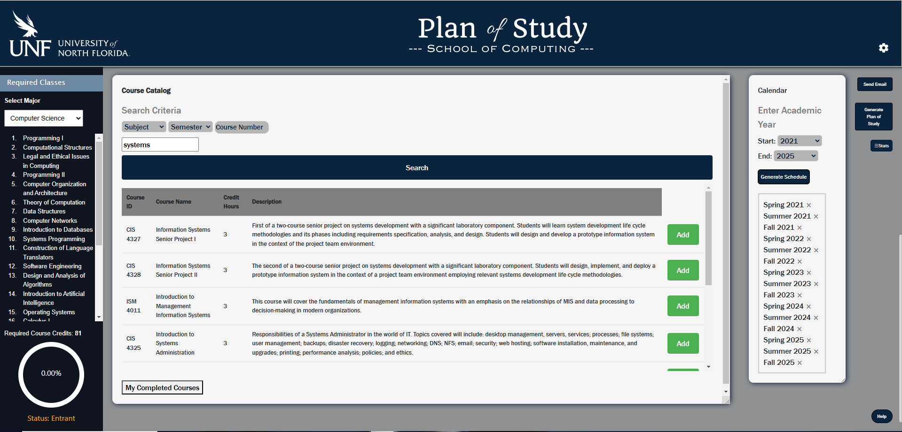

### Homepage

# Plan of Study Web Application
Web application designed to help students plan and organize their studies. It provides features such as creating, managing, and tracking study goals and tasks, all within an easy-to-use interface.

# Features
- Generate a study plan PDF that reflects recommended courses to take throughout the college career.
- Visualize study schedules and track progress over time.
- Email functionality to send study plans to school academic advisors (or other recipients) using Flask-Mail.

### Frontend:
- HTML
- CSS
- JavaScript
- jQuery

### Backend:
- Flask
- Flask-SQLAlchemy
- Flask-Mail

### Other Tools:
- Bootstrap

### Prerequisites:
- Python 3.x installed on your system.
- `pip` (Python package manager).

### Installation
1. Clone the repository: git clone https://github.com/your-username/repository-name.git
2. Navigate into the project directory: cd repository-name
3. (Optional) Create a virtual environment: python -m venv venv
4. On Windows: .\venv\Scripts\activate
   On macOS/Linux: source venv/bin/activate
6. Install dependencies:
    pip install -r requirements.txt
7. Run the application: python app.py
8. Open the application in your browser at: http://127.0.0.1:5000
